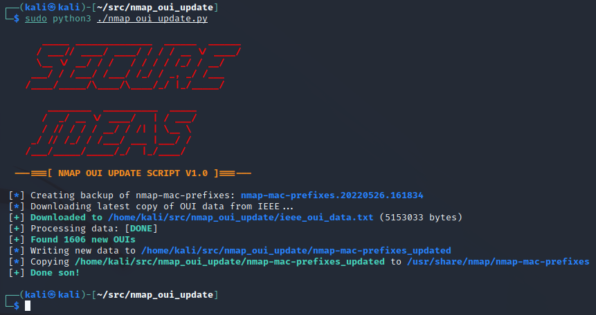

# nmap_oui_update
A script to download OUI data from the IEEE and parse it into the nmap-mac-prefixes file so Nmap has the latest OUI data.

## Related Blog
TODO: Populate when blog is live.

## Overview
This script is designed to help update Nmap's `nmap-mac-prefixes` file with the latest data from the IEEE.  This script when run will do the following:

 * Create a backup copy of the nmap-mac-prefixes file to ./backup
 * Download the IEEE’s OUI file from the internet
 * Parse missing entries from the IEEE data and add it to the nmap-mac-prefixes data in a new file nmap-mac-prefixes_updated
 * Copy the nmap-mac-prefixes_updated to /usr/share/nmap/nmap-mac-prefixes

